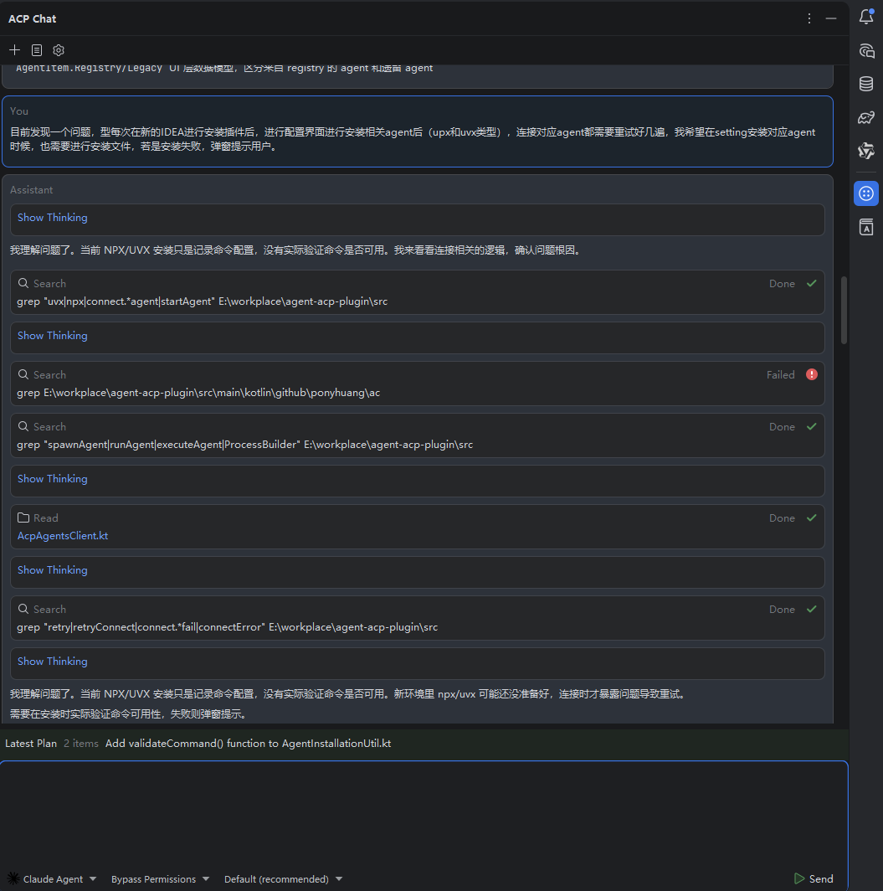
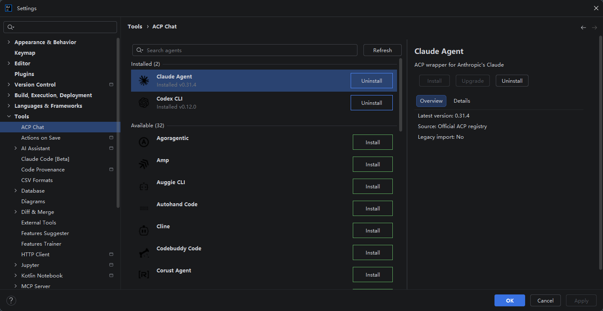

# ACP Chat IntelliJ Plugin


## 项目简介

`ACP Chat` 是一个 IntelliJ Platform 插件，用于在 IDE 内接入 ACP Agent，并提供聊天窗口、Agent 管理与基础配置界面。

## 重要提示

> [!WARNING]
> 该项目当前仍处于早期开发阶段，已知存在较多 Bug、兼容性问题和未完善的交互细节。
> **不推荐直接用于生产环境、正式团队环境或关键业务场景。**
>
> 如果你只是想体验或二次开发，建议先在独立的测试 IDE / Sandbox 环境中使用。

## 当前状态

- 项目尚未整理为可直接发布即用的稳定版本
- 默认更适合本地研究、功能验证和二次开发
- 使用前通常需要自行编译插件，并手动安装到 IntelliJ IDEA 或其他 JetBrains IDE

<!-- Plugin description -->
ACP Chat 是一个 IntelliJ Platform 插件，用于在 IDE 内接入 ACP Agent，并提供聊天窗口、Agent 安装入口与基础配置能力。

当前版本仍处于开发早期，存在较多已知和未知问题，更适合测试、演示与二次开发，不建议直接用于生产环境。
<!-- Plugin description end -->

## 功能概览

- 在 IDE 中提供 `ACP Chat` 工具窗口
- 支持查看和切换可用 Agent
- 提供设置页中的 Agent 安装与管理入口
- 支持本地编译后手动安装插件进行体验

## 插件界面示例

### 聊天工具窗口



### 设置页中的 Agent 管理界面



## 环境要求

在本地编译和安装前，请先准备以下环境：

- JDK 21
- Gradle Wrapper（仓库已自带，直接使用 `./gradlew` 或 `.\gradlew.bat` 即可）
- 一个 JetBrains IDE
  - 推荐 IntelliJ IDEA 2025.2.x 或与项目配置兼容的版本

## 本地编译

在项目根目录执行：

```powershell
.\gradlew.bat buildPlugin
```

构建成功后，插件产物通常位于：

```text
build/distributions/
```

你也可以在开发调试时使用：

```powershell
.\gradlew.bat runIde
```

这会启动一个带有插件的 Sandbox IDE，用于本地调试。

## 安装教程

由于当前项目不建议按“开箱即用”的生产插件理解，**推荐自行编译后再手动安装**。

### 方式一：手动安装编译产物

1. 克隆项目源码
2. 在项目根目录执行：

```powershell
.\gradlew.bat buildPlugin
```

3. 在 `build/distributions/` 下找到生成的 ZIP 插件包
4. 打开你的 JetBrains IDE
5. 进入 `Settings/Preferences > Plugins`
6. 点击右上角齿轮图标
7. 选择 `Install Plugin from Disk...`
8. 选择刚刚生成的 ZIP 文件并确认安装
9. 重启 IDE

### 方式二：使用 Sandbox IDE 直接调试运行

如果你只是想体验当前开发版本，而不是安装到日常 IDE，可以直接运行：

```powershell
.\gradlew.bat runIde
```

Gradle 会启动一个独立的 Sandbox IDE，并自动加载当前插件。

## 验证命令

建议在本地安装前至少执行一次：

```powershell
.\gradlew.bat check
```

如需执行插件结构与兼容性检查，可继续运行：

```powershell
.\gradlew.bat verifyPlugin
```

## 使用建议

- 请优先在测试项目中体验
- 不要直接在核心工作项目中长期启用当前版本
- 如果遇到 Agent 安装、连接或界面行为异常，请默认按“当前版本可能存在缺陷”处理
- 如果你准备基于本项目继续开发，建议先从 `toolWindow/`、`settings/` 与 `services/` 目录开始阅读

## 仓库结构

- `src/main/kotlin/github/ponyhuang/acpplugin/toolwindow/`：聊天工具窗口 UI
- `src/main/kotlin/github/ponyhuang/acpplugin/settings/`：设置页与 Agent 管理界面
- `src/main/kotlin/github/ponyhuang/acpplugin/services/`：会话、注册表、权限与连接相关服务
- `src/main/resources/META-INF/plugin.xml`：插件声明

## 免责声明

本项目目前更接近实验性插件实现，而非稳定可商用产品。你需要自行评估：

- 兼容性风险
- 数据与工作流影响
- 安装与使用成本
- 本地调试和排障成本

---

Plugin based on the [IntelliJ Platform Plugin Template][template].

[template]: https://github.com/JetBrains/intellij-platform-plugin-template
